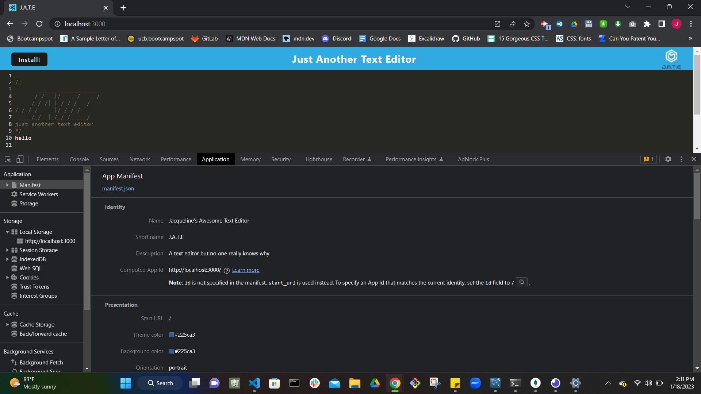
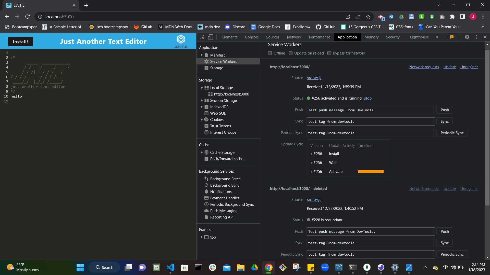
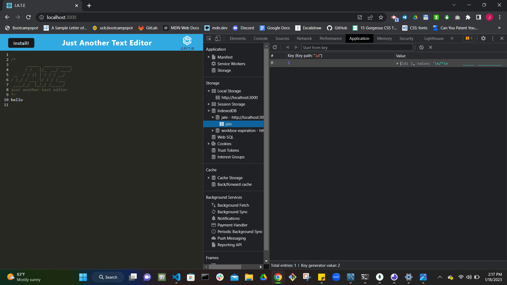

# PWA-Text_Editor

# Description

This single-page PWA application is built to run in the browser with or without internet connection. It features various different methods for storing and retrieving data. The text editor allows a developer to create code snippets or notes so that they can be retrieved later on reliably. 

## Table of Contents 
* [Technologies Used](#technologies-used)
* [Installation](#installation)
* [Screenshots](#screenshots)
* [Demo](#demo)
* [Links](#links)
* [Contributors](#contributors)

## Technologies Used

- PWA
- IndexedDB
- Node.js
- Express.js

## Installation

How to run the application locally (after installing dependencies):

- Clone this repository
- Run "npm install" in the command line of your terminal
- Run "npm start" 
- Go to (http//:localhost:3000) 

## Screenshots

## Demo 

## Links

GitHub repository URL: 
https://github.com/JacquelineHockin/PWA-Text_Editor

## Contributors 
- Jacqueline Cashman
- [GitHub: JacquelineHockin](https://github.com/jacquelinehockin)